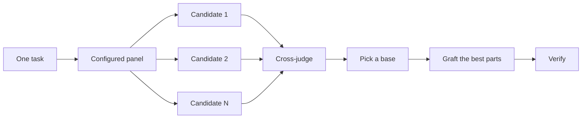

# Design before you write code

One attempt at a hard design locks in the first shape the model thought of. `/architect` settles types and boundaries before implementation. `/arena` runs several attempts at the same brief and merges the best parts. `/interrogate` has other models try to break the result. When the job is coverage rather than design synthesis, `/swarm` fans out slices or races and aggregates their results.

When the job is how the UI looks, `/nax-mode` matches the [Design playbook](../../skills/nax-mode/playbooks/design.md). That is a different kind of design. Architect settles types. The Design playbook settles visual language.

## Design a UI with the Design playbook

There is no separate `/design` slash command. Start with `/nax-mode` and talk about the page. The playbook matches phrases like "design this page", "redesign this", "build this screenshot", "make it neobrutalist", or "not generic AI slop".

Name the **surface** in the prompt. Marketing pages (landing, portfolio, editorial, product marketing) load `design-taste-frontend`. Product UI (dashboard, table, settings, multi-step flow) does not. If you skip the surface, the agent has to guess, and taste-skill on a dashboard is the usual miss.

Name the **kind** when you know it. Skip it when you don't. The playbook classifies from the rest of the prompt.

| Kind | Say this | What fires |
|---|---|---|
| `greenfield` | "design a landing page for this product" | taste-skill on marketing, guidelines as the spec on product UI |
| `redesign` | "redesign this page, keep the copy and the conversion path" | audit first, then the same skills as greenfield |
| `image-match` | attach a screenshot, then "build this" | `image-to-code`. Behavior on product UI still follows guidelines |
| `named-style` | "make it editorial" or "neobrutalist" | one catalog slug from a pinned Awesome Design Skills commit |

A request can carry two kinds. "redesign this landing page, make it editorial" runs both rows.

Ask for screenshots in the same prompt. The playbook already verifies at narrow, laptop, and wide. Saying "screenshot the result" makes that the finish condition you will look at.

### Prompts that work

```text
/nax-mode design a landing page for this product. not generic AI slop. screenshot the result.
```

```text
/nax-mode redesign this marketing page. keep the headline, the pricing, and the signup path. screenshot desktop and mobile.
```

```text
/nax-mode build this screenshot into the marketing site. match layout and type. screenshot the result.
```

```text
/nax-mode make this landing page neobrutalist. if two catalog slugs fit, prototype both.
```

```text
/nax-mode restyle this settings table. follow web-design-guidelines. screenshot empty, loaded, and error.
```

The last one is product UI. Taste-skill stays off. Guidelines own behavior. A named style, if you add one, is surface treatment only.

### What not to use it for

- Pixel-exact matching of two implementations is [Visual parity](../../skills/nax-mode/playbooks/visual-parity.md).
- A throwaway layout sketch to decide something is [Prototype](../../skills/nax-mode/playbooks/prototype.md).
- Types, module boundaries, and caller usage are [`/architect`](../../skills/architect/SKILL.md). That is a different kind of design.

The Design playbook presents the work. It does not commit or open a PR unless you ask.

Source skills: [design-taste-frontend](../../skills/design-taste-frontend/SKILL.md) from [Taste Skill](https://github.com/Leonxlnx/taste-skill), [image-to-code](../../skills/image-to-code/SKILL.md), [web-design-guidelines](../../skills/web-design-guidelines/SKILL.md) from [Vercel](https://github.com/vercel-labs/agent-skills/tree/main/skills/web-design-guidelines), and [design-style-catalog](../../skills/design-style-catalog/SKILL.md) from a pinned [Awesome Design Skills](https://github.com/bergside/awesome-design-skills) commit.

## Settle the shape with `/architect`

```text
/architect design the import pipeline before writing any code. i care most about how callers use it.
```

[`/architect`](../../skills/architect/SKILL.md) grounds itself first, running `/how` over the code the design touches and `/why` when it moves ownership or layers. Then it runs `/arena` to produce competing design sketches, with the caller's usage written first in each, followed by types, signatures, and a module map.

By default it proceeds straight from the synthesized design into implementation. If you want to see the design first, say so:

```text
/architect with checkpoint. stop and show me before implementing.
```

## Fan out attempts with `/arena`

```text
/arena take my prompt to the arena verbatim. i want to compare their proposals with yours.
```

[`/arena`](../../skills/arena/SKILL.md) is the general tool underneath. N subagents attempt the same design or code brief in parallel, each writing to its own worktree or directory. A read-only judge, on a different model family when your configuration allows one, scores every candidate against a rubric. The coordinator reads each candidate end to end, picks a base, grafts in the best ideas from the losers, and verifies the result.



The panel comes from your [`/setup-pstack`](../../skills/setup-pstack/SKILL.md) configuration, and you can adjust it per task. Ask for more candidates when the decision matters, fewer when it doesn't:

```text
/arena this, 5 candidates. the cache key format is expensive to change later.
```

## Cover slices and races with `/swarm`

```text
/swarm check every package under packages/ against its check.sh. one worker per package. one report.
```

[`/swarm`](../../skills/swarm/SKILL.md) fans N workers across independent slices, coverage matrices, gauntlet lanes, exploration partitions, or declared race arms. Each worker gets its own scope and check, then reports `PASS`, `ISSUES`, or `BLOCKED`. The parent waits for the workers and returns one compact report with any gaps or dropouts.

Reach for it when parallelism buys coverage or lets independent checks race. `/arena` gives every worker the same design or code brief, then picks a base and grafts the best parts. `/swarm` covers slices or runs a race with a selection rule declared up front. It does not use the base-selection and grafting ceremony.

## Break it with `/interrogate`

```text
/interrogate the whole branch, but skeptically. no nitpicks unless it's an actual bug or regression.
```

[`/interrogate`](../../skills/interrogate/SKILL.md) sends the same diff, intent, and rubric to several reviewers on different model families. Model diversity is the point. Different models have different blind spots, so a finding two models raise independently is high-confidence signal. The lead sorts everything into `Act on`, `Consider`, `Noted`, and `Dismissed`, with a reason for each dismissal, and applies nothing automatically.

Read the dismissals too. The lead is a pragmatic senior engineer, not an oracle, and you can override it.

## How much design work does a task deserve?

You might be wondering whether every change needs this. No. Most changes need none of it. A rough ladder:

- A small, finished change you're unsure about needs `/interrogate` alone.
- A change that crosses function boundaries or moves ownership earns `/architect`, which brings `/arena` with it.
- A standalone decision where independent attempts would help, like naming, formats, or an algorithm, is `/arena` directly.
- A coverage matrix, set of parallel checks, or race with declared arms is `/swarm`.
- A contested design that's expensive to reverse gets `/architect`, then `/interrogate` before shipping.

`/nax-mode` already applies this ladder. Boundary-crossing work triggers `/architect` on its own, so you reach for these directly mainly when you want more or less scrutiny than the default.

Next: [Build and clean the change](./05-build-and-clean.md).
